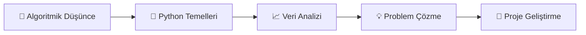
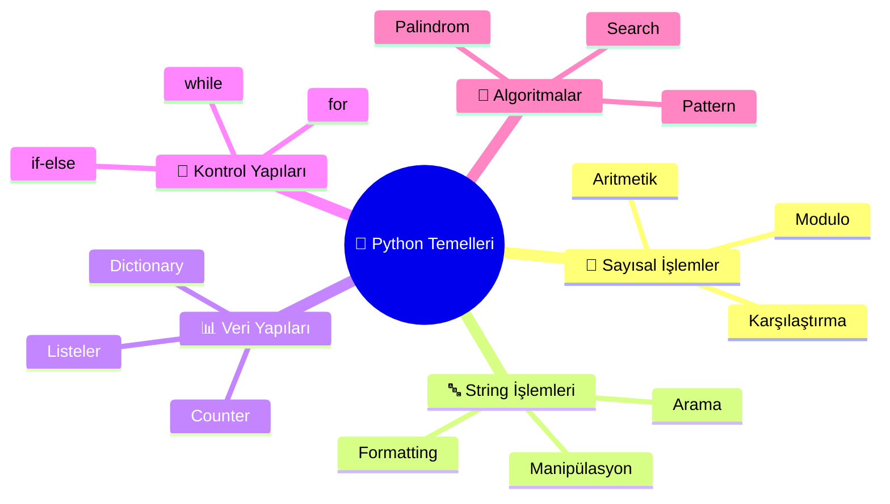
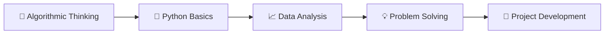
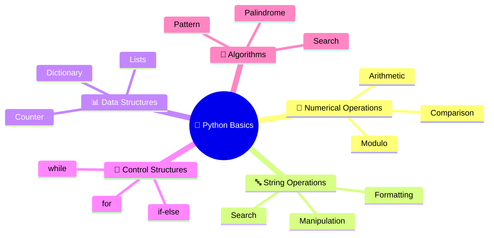

# 🐍 Python Temel Programlama Soruları

<div align="center">


**🚀 Algoritmik Düşünce ve Problem Çözme Becerileri**

[📚 Sorular](#-sorular) • [🎬 Mini Proje](#-mini-proje---film-yorumu-analizi) • [🛠️ Kurulum](#️-kurulum)

</div>

---

## 📊 Proje İstatistikleri

| 📈 Metrik | 🔢 Değer |
|-----------|-----------|
| **Toplam Soru** | 9 |
| **Mini Proje** | 1 |
| **Kapsanan Konular** | 15+ |
| **Programlama Dili** | Python 🐍 |

---

## 🎯 Öğrenme Hedefleri



- **🧠 Algoritmik Düşünce**: Problem çözme stratejileri ve mantıksal yaklaşım
- **🔧 Python Temelleri**: Döngüler, koşullar, veri yapıları ve string işlemleri  
- **📈 Veri Analizi**: İstatistik, filtreleme ve pattern recognition
- **💡 Problem Çözme**: Gerçek dünya problemlerine programatik çözümler

---

## 📚 Sorular

### 🔢 Soru 1 - Sayı Analizi
> **Amaç**: Girilen sayının özelliklerini analiz etmek

**🎯 Ne Yapıyor:**
- Sayının pozitif/negatif/sıfır kontrolü
- Tek/çift sayı tespiti
- Kombinasyon analizi (Örn: "Pozitif Çift")

**🛠️ Kullanılan Teknolojiler:**
```python
✅ if-else yapısı
✅ modulo operatörü (%)
✅ input() fonksiyonu
✅ koşullu string birleştirme
```

---

### 🔤 Soru 2 - Harf Frekans Analizi
> **Amaç**: Kelimelerdeki harf dağılımını analiz etmek

**🎯 Ne Yapıyor:**
- Her harfin geçme sayısını hesaplar
- Dictionary formatında sonuç döndürür
- Counter modülü kullanımı

**🛠️ Kullanılan Teknolojiler:**
```python
✅ collections.Counter
✅ string manipülasyonu
✅ dictionary yapısı
```

**💡 Örnek Çıktı:**
```
Input: "data" 
Output: Counter({'a': 2, 'd': 1, 't': 1})
```

---

### 🔐 Soru 3 - Şifre Güvenlik Kontrolü
> **Amaç**: Güçlü şifre kriterlerini kontrol etmek

**🎯 Kontrol Kriterleri:**
- ✅ En az 8 karakter
- ✅ En az 1 büyük harf
- ✅ En az 1 rakam

**🛠️ Kullanılan Teknolojiler:**
```python
✅ string methods (isupper(), isdecimal())
✅ len() fonksiyonu
✅ list comprehension
✅ güvenlik validation
```

---

### 📊 Soru 4 - Liste Operasyonları
> **Amaç**: Matematiksel liste analizi ve filtreleme

**🎯 Ne Yapıyor:**
- Liste ortalamasını hesaplar
- Ortalamadan büyük sayıları ayırır
- Dinamik liste manipülasyonu

**🛠️ Kullanılan Teknolojiler:**
```python
✅ liste işlemleri
✅ matematiksel hesaplamalar
✅ döngüler ve koşullar
✅ liste filtreleme
```

**📈 Test Verisi:**
```python
data = [12, 4, 9, 25, 30, 7, 18]
ortalama = 15.0
büyükler = [25, 30, 18]
```

---

### ⭐ Soru 5 - Desen Çizimleri
> **Amaç**: Nested loop ile geometrik desenler

**🎯 Ne Yapıyor:**
```
*
**
***
****
*****
```

**🛠️ Kullanılan Teknolojiler:**
```python
✅ nested loops
✅ string çarpma (*)
✅ range() fonksiyonu
✅ pattern algorithms
```

---

### 🔄 Soru 6 - While Döngü Kontrolü
> **Amaç**: Dinamik veri toplama ve istatistik

**🎯 Ne Yapıyor:**
- Kullanıcıdan sürekli sayı alır
- 0 girildiğinde durur
- Toplam ve ortalama hesaplar

**🛠️ Kullanılan Teknolojiler:**
```python
✅ while döngüsü
✅ break statement
✅ sayaç ve toplam değişkenleri
✅ istatistiksel hesaplamalar
```

---

### 🔄 Soru 7 - Palindrom Detektörü
> **Amaç**: String simetri analizi

**🎯 Ne Yapıyor:**
- Kelimenin tersini kontrol eder
- Case-insensitive karşılaştırma
- Algoritma mantığı kullanır

**🛠️ Kullanılan Teknolojiler:**
```python
✅ string indexing
✅ lower() metodu
✅ algoritma tasarımı
✅ boolean logic
```

**💡 Örnekler:**
```
✅ "kayak" → Palindrom
✅ "Kayak" → Palindrom  
❌ "python" → Değil
```

---

### 📝 Soru 8 - List Comprehension
> **Amaç**: Matematiksel filtreleme ve dönüşüm

**🎯 Ne Yapıyor:**
- 1-100 arası sayıları tarar
- 3'e VE 5'e bölünebilenleri bulur
- Karelerini hesaplar

**🛠️ Kullanılan Teknolojiler:**
```python
✅ range() fonksiyonu
✅ modulo operatörü
✅ çoklu koşul kontrolü
✅ matematiksel işlemler
```

**📊 Sonuç:**
```python
[15, 30, 45, 60, 75, 90]  # 3 ve 5'e bölünenler
```

---

### 🔤 Soru 9 - String Formatlaması
> **Amaç**: Metin işleme ve formatlaması

**🎯 Ne Yapıyor:**
- Cümleyi kelimelere ayırır
- Her kelimenin ilk harfini büyütür
- Yeni formatlı string oluşturur

**🛠️ Kullanılan Teknolojiler:**
```python
✅ split() metodu
✅ capitalize() metodu
✅ string concatenation
✅ döngüler
```

**💡 Örnek:**
```
Input: "python veri bilimi"
Output: "Python Veri Bilimi"
```

---

## 🎬 Mini Proje - Film Yorumu Analizi

<div align="center">

### 📊 Gelişmiş Text Mining ve İstatistiksel Analiz

</div>

> **🎯 Amaç**: Gerçek dünya veri analizi simülasyonu

### 🚀 Özellikler

| 🔍 Özellik | 📝 Açıklama |
|------------|-------------|
| **📊 İstatistiksel Analiz** | Yorum uzunlukları, ortalama hesaplama |
| **🔍 Keyword Detection** | "İyi" kelime arama ve sayma algoritması |
| **📏 Min/Max Bulma** | En uzun ve kısa yorum tespiti |
| **💾 Dinamik Veri Toplama** | While döngüsü ile esnek input sistemi |

### 📈 Analiz Sonuçları
```
🎬 Film Yorumu Analiz Raporu
=====================================
📊 Toplam yorum sayısı: 7
🔍 "iyi" geçen yorum sayısı: 2
📏 En uzun yorum: "baya iyi"
📏 En kısa yorum: "iyi"
📈 Ortalama uzunluk: 5.57 karakter
```

### 🧠 Kullanılan Algoritma ve Yapılar
```python
✅ While döngüsü ve break logic
✅ Liste manipülasyonu
✅ String arama algoritmaları  
✅ Min/Max bulma algoritmaları
✅ İstatistiksel hesaplamalar
✅ Kullanıcı etkileşimi (UX)
```

---

## 🛠️ Kurulum

### 📋 Gereksinimler
```bash
Python 3.8+
Jupyter Notebook/Lab
```

### ⚡ Hızlı Başlangıç

1. **📂 Repository'yi klonlayın:**
```bash
git clone https://github.com/Software-Guardians/Python-Basic-Template-2
cd Python-Basic-Template-2
```

2. **🚀 Jupyter'ı başlatın:**
```bash
# Jupyter Notebook
jupyter notebook

# Veya JupyterLab (önerilen)
jupyter lab
```

3. **📖 Notebook'u açın:**
```
main.ipynb
```

---

## 📚 Konu Haritası



---

## 🎓 Seviye Rehberi

| 📶 Seviye | 🎯 Sorular | 💡 Öğrenecekleriniz |
|-----------|------------|---------------------|
| **🟢 Başlangıç** | 1, 5, 9 | Temel syntax, basit algoritmalar |
| **🟡 Orta** | 2, 3, 4, 6, 8 | Veri yapıları, döngüler |
| **🔴 İleri** | 7, Mini Proje | Algoritma tasarımı, kompleks mantık |

---

## 🤝 Katkıda Bulunma

1. 🍴 Fork yapın
2. 🌟 Feature branch oluşturun (`git checkout -b feature/amazing-feature`)
3. 💾 Commit yapın (`git commit -m 'Add amazing feature'`)
4. 📤 Push edin (`git push origin feature/amazing-feature`)
5. 🔄 Pull Request açın

---

## 📄 Lisans

Bu proje [MIT](LICENSE) lisansı altında lisanslanmıştır.

---

## 📞 İletişim

🐙 GitHub: [Emrullah Enis Çetinkaya](https://github.com/emrullah-enis-ctnky)
📧 Email: eniscetinkaya951@gmail.com

---

<div align="center">

### 💡 **Kodlayarak öğrenin, pratik yaparak ustalaşın!** 💡

**⭐ Beğendiyseniz yıldız vermeyi unutmayın! ⭐**


</div>

---

# 🐍 Python Basic Programming Questions

<div align="center">


**🚀 Algorithmic Thinking and Problem Solving Skills**

[📚 Questions](#-questions-1) • [🎬 Mini Project](#-mini-project---movie-review-analysis) • [🛠️ Installation](#️-installation-1)

</div>

---

## 📊 Project Statistics

| 📈 Metric | 🔢 Value |
|-----------|-----------|
| **Total Questions** | 9 |
| **Mini Project** | 1 |
| **Covered Topics** | 15+ |
| **Programming Language** | Python 🐍 |

---

## 🎯 Learning Objectives



- **🧠 Algorithmic Thinking**: Problem-solving strategies and logical approach
- **🔧 Python Basics**: Loops, conditions, data structures, and string operations
- **📈 Data Analysis**: Statistics, filtering, and pattern recognition
- **💡 Problem Solving**: Programmatic solutions to real-world problems

---

## 📚 Questions

### 🔢 Question 1 - Number Analysis
> **Purpose**: Analyze the properties of the entered number

**🎯 What it does:**
- Positive/negative/zero check
- Odd/even number detection
- Combination analysis (e.g., "Positive Even")

**🛠️ Technologies Used:**
```python
✅ if-else structure
✅ modulo operator (%)
✅ input() function
✅ conditional string concatenation
```

---

### 🔤 Question 2 - Letter Frequency Analysis
> **Purpose**: Analyze letter distribution in words

**🎯 What it does:**
- Calculates occurrence count of each letter
- Returns result in dictionary format
- Uses Counter module

**🛠️ Technologies Used:**
```python
✅ collections.Counter
✅ string manipulation
✅ dictionary structure
```

**💡 Example Output:**
```
Input: "data" 
Output: Counter({'a': 2, 'd': 1, 't': 1})
```

---

### 🔐 Question 3 - Password Security Check
> **Purpose**: Check strong password criteria

**🎯 Validation Criteria:**
- ✅ At least 8 characters
- ✅ At least 1 uppercase letter
- ✅ At least 1 digit

**🛠️ Technologies Used:**
```python
✅ string methods (isupper(), isdecimal())
✅ len() function
✅ list comprehension
✅ security validation
```

---

### 📊 Question 4 - List Operations
> **Purpose**: Mathematical list analysis and filtering

**🎯 What it does:**
- Calculates list average
- Separates numbers greater than average
- Dynamic list manipulation

**🛠️ Technologies Used:**
```python
✅ list operations
✅ mathematical calculations
✅ loops and conditions
✅ list filtering
```

**📈 Test Data:**
```python
data = [12, 4, 9, 25, 30, 7, 18]
average = 15.0
greater_than_avg = [25, 30, 18]
```

---

### ⭐ Question 5 - Pattern Drawing
> **Purpose**: Geometric patterns with nested loops

**🎯 What it does:**
```
*
**
***
****
*****
```

**🛠️ Technologies Used:**
```python
✅ nested loops
✅ string multiplication (*)
✅ range() function
✅ pattern algorithms
```

---

### 🔄 Question 6 - While Loop Control
> **Purpose**: Dynamic data collection and statistics

**🎯 What it does:**
- Continuously takes numbers from user
- Stops when 0 is entered
- Calculates sum and average

**🛠️ Technologies Used:**
```python
✅ while loop
✅ break statement
✅ counter and sum variables
✅ statistical calculations
```

---

### 🔄 Question 7 - Palindrome Detector
> **Purpose**: String symmetry analysis

**🎯 What it does:**
- Checks the reverse of the word
- Case-insensitive comparison
- Uses algorithm logic

**🛠️ Technologies Used:**
```python
✅ string indexing
✅ lower() method
✅ algorithm design
✅ boolean logic
```

**💡 Examples:**
```
✅ "kayak" → Palindrome
✅ "Kayak" → Palindrome  
❌ "python" → Not palindrome
```

---

### 📝 Question 8 - List Comprehension
> **Purpose**: Mathematical filtering and transformation

**🎯 What it does:**
- Scans numbers from 1-100
- Finds numbers divisible by both 3 AND 5
- Calculates their squares

**🛠️ Technologies Used:**
```python
✅ range() function
✅ modulo operator
✅ multiple condition check
✅ mathematical operations
```

**📊 Result:**
```python
[15, 30, 45, 60, 75, 90]  # Numbers divisible by 3 and 5
```

---

### 🔤 Question 9 - String Formatting
> **Purpose**: Text processing and formatting

**🎯 What it does:**
- Splits sentence into words
- Capitalizes first letter of each word
- Creates new formatted string

**🛠️ Technologies Used:**
```python
✅ split() method
✅ capitalize() method
✅ string concatenation
✅ loops
```

**💡 Example:**
```
Input: "python data science"
Output: "Python Data Science"
```

---

## 🎬 Mini Project - Movie Review Analysis

<div align="center">

### 📊 Advanced Text Mining and Statistical Analysis

</div>

> **🎯 Purpose**: Real-world data analysis simulation

### 🚀 Features

| 🔍 Feature | 📝 Description |
|------------|-------------|
| **📊 Statistical Analysis** | Comment lengths, average calculation |
| **🔍 Keyword Detection** | "Good" word search and counting algorithm |
| **📏 Min/Max Finding** | Longest and shortest comment detection |
| **💾 Dynamic Data Collection** | Flexible input system with while loop |

### 📈 Analysis Results
```
🎬 Movie Review Analysis Report
=====================================
📊 Total number of comments: 7
🔍 Comments containing "good": 2
📏 Longest comment: "pretty good"
📏 Shortest comment: "good"
📈 Average length: 5.57 characters
```

### 🧠 Used Algorithms and Structures
```python
✅ While loop and break logic
✅ List manipulation
✅ String search algorithms  
✅ Min/Max finding algorithms
✅ Statistical calculations
✅ User interaction (UX)
```

---

## 🛠️ Installation

### 📋 Requirements
```bash
Python 3.8+
Jupyter Notebook/Lab
```

### ⚡ Quick Start

1. **📂 Clone the repository:**
```bash
git clone https://github.com/Software-Guardians/Python-Basic-Template-2
cd Python-Basic-Template-2
```

2. **🚀 Start Jupyter:**
```bash
# Jupyter Notebook
jupyter notebook

# Or JupyterLab (recommended)
jupyter lab
```

3. **📖 Open the notebook:**
```
main.ipynb
```

---

## 📚 Topic Map



---

## 🎓 Level Guide

| 📶 Level | 🎯 Questions | 💡 What You'll Learn |
|----------|-------------|---------------------|
| **🟢 Beginner** | 1, 5, 9 | Basic syntax, simple algorithms |
| **🟡 Intermediate** | 2, 3, 4, 6, 8 | Data structures, loops |
| **🔴 Advanced** | 7, Mini Project | Algorithm design, complex logic |

---

## 🤝 Contributing

1. 🍴 Fork the project
2. 🌟 Create your feature branch (`git checkout -b feature/amazing-feature`)
3. 💾 Commit your changes (`git commit -m 'Add amazing feature'`)
4. 📤 Push to the branch (`git push origin feature/amazing-feature`)
5. 🔄 Open a Pull Request

---

## 📄 License

This project is licensed under the [MIT](LICENSE) License.

---

## 📞 Contact

🐙 GitHub: [Emrullah Enis Çetinkaya](https://github.com/emrullah-enis-ctnky)
📧 Email: eniscetinkaya951@gmail.com

---

<div align="center">

### 💡 **Learn by coding, master by practicing!** 💡

**⭐ Don't forget to star if you liked it! ⭐**


</div>